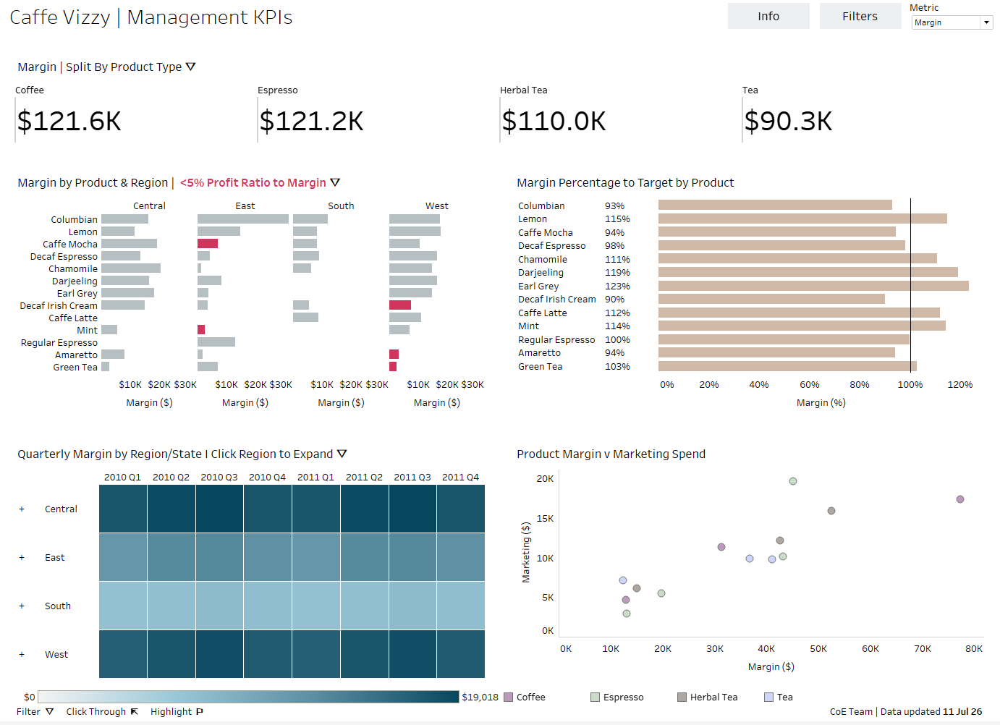

# Executive Business Intelligence Dashboard

An interactive Executive Business Intelligence Dashboard built in Tableau Desktop using advanced dashboard actions, parameters, calculated fields, and FIXED LOD expressions to monitor business performance and support executive decision-making.

## Dashboard Preview

## Project Overview

This dashboard enables stakeholders to monitor business performance through interactive KPIs, regional analysis, profitability insights, quarterly trends, and marketing spend analysis.

## Key Features

- Executive KPI Dashboard
- Interactive Filters
- Parameter-driven Analytics
- FIXED LOD Expressions
- Dashboard Actions
- Dynamic KPI Selection
- Regional Performance Analysis
- Quarterly Trend Analysis
- Profitability Analysis
- Target vs Actual Analysis

## Technologies Used

- Tableau Desktop
- Calculated Fields
- FIXED LOD Expressions
- Parameters
- Dashboard Actions
- Data Visualization
- Business Intelligence

## Project Statistics

| Metric | Value |
|---------|------:|
| Executive Dashboards | 1 |
| Worksheets | 8 |
| Calculated Fields | 125 |
| Dashboard Actions | 3 |
| FIXED LOD Expressions | 2 |
| Parameters | 30 |

## Business Value

This dashboard enables business stakeholders to:

- Monitor KPIs from a single executive view.
- Analyze regional performance.
- Compare quarterly business trends.
- Evaluate marketing effectiveness.
- Track target achievement.
- Support data-driven decision making through interactive analytics.

## Skills Demonstrated

Tableau Desktop • Dashboard Design • KPI Development • Executive Reporting • Calculated Fields • FIXED LOD Expressions • Parameters • Dashboard Actions • Interactive Analytics • Business Intelligence

## Repository Contents

- `Executive_Business_Intelligence_Dashboard.twbx`
- `README.md`
- `Dashboard.png`

## Author

**Shrinkhla Sharma**  
Business Intelligence Analyst

## Future Enhancements

- Integrate a live SQL data source.
- Publish the dashboard on Tableau Public.
- Automate data refresh using Tableau Cloud.
- Extend the dashboard with predictive analytics.
- Develop a Power BI version.
